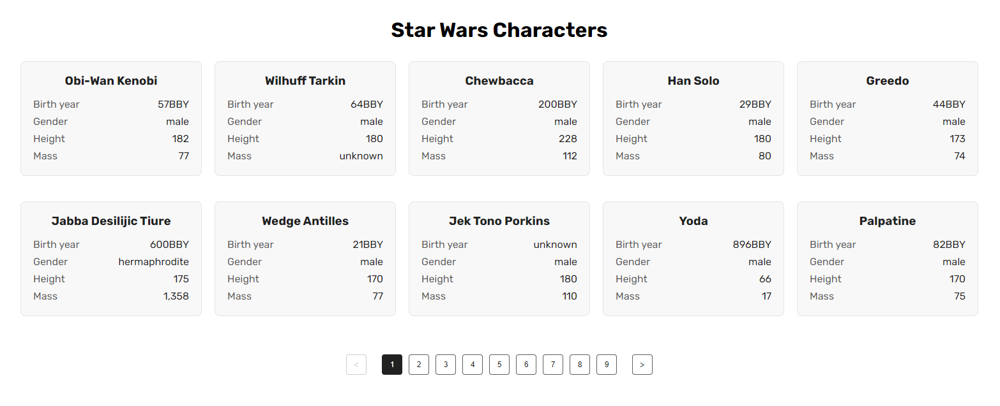
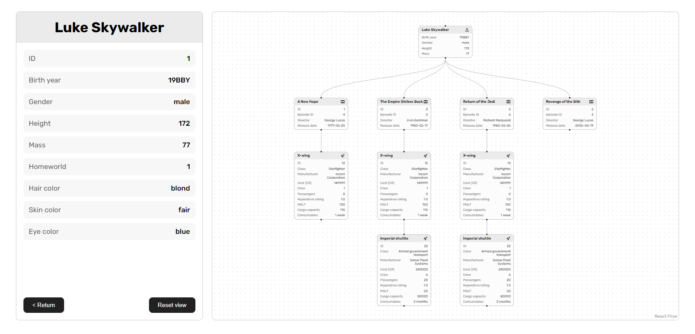

# STARNAVI Test Task - React

Welcome! This is a React application that was created as a test task for STARNAVI. The application is an observer for Star Wars characters and details for each character.

Task description can be found [here](https://docs.google.com/document/d/1TV_hGp2zbnVVPqA4-dXi3XEcYJIXufBbCZU7aBLVZCw/edit).

Short video demonstration can be found [here](https://www.loom.com/share/5594a8e579be4d1e9907514d1d4aa355?sid=5b386e47-d939-452d-92ac-a605fd20a880).

## Screenshots

### Main page


### Person page


## Technologies

- React
- TypeScript
- Vite
- SCSS
- Axios
- [react-spinners](https://www.npmjs.com/package/react-spinners)

## Launch

1. Clone the repository

```bash
git clone https://github.com/kinqbert/starnavi-test-task.git
```

2. Install dependencies

```bash
npm install
```

3. Start the development server

```bash
npm run dev
```

4. Open the browser and navigate to [http://localhost:5173](http://localhost:5173)
